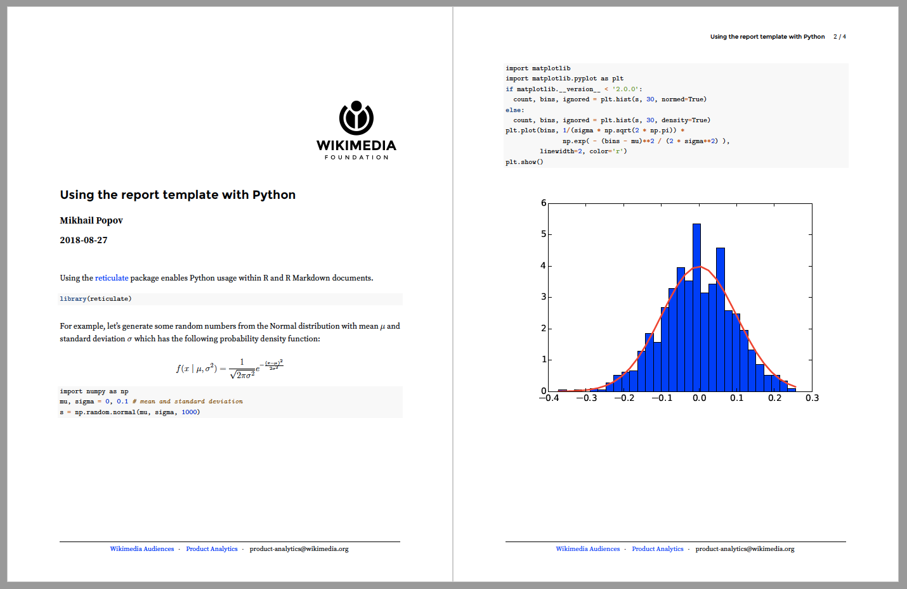
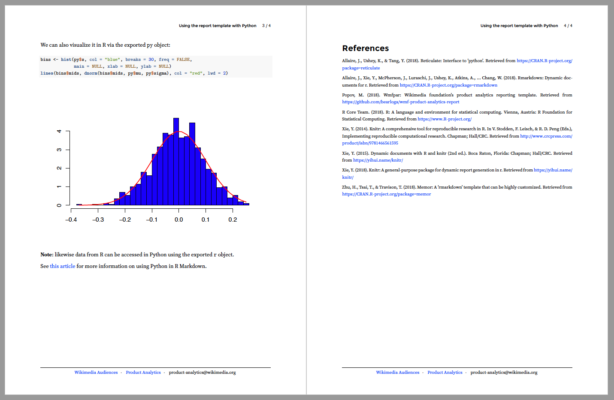

# WMF Product Analytics Reporting Template

A report template, based on [memor](https://hebrewseniorlife.github.io/memor/) template, for use by the [Product Analytics](https://www.mediawiki.org/wiki/Product_Analytics) team within [Wikimedia Audiences](https://www.mediawiki.org/wiki/Wikimedia_Audiences) department.

**Note**: this report template uses [R Markdown](https://rmarkdown.rstudio.com/), which [supports Python](https://rstudio.github.io/reticulate/articles/r_markdown.html), meaning data analysis does not have to be done in R. In addition to that, [data can fetched with SQL](https://bookdown.org/yihui/rmarkdown/language-engines.html#sql) from a database and then transferred between R and Python chunks. For example, see [python.Rmd](inst/example/python.Rmd) and [python.pdf](inst/example/python.pdf):




## Prerequisites

- **Fonts**
  - xelatex engine, most easily installed with [tinytex](https://yihui.name/tinytex/) R package
  - [Montserrat](https://fonts.google.com/specimen/Montserrat) (Bold) for header text
  - [Source Serif Pro](https://fonts.google.com/specimen/Source+Serif+Pro) for body text
- [Pandoc](https://pandoc.org/)
  - included with [RStudio](https://www.rstudio.com/products/rstudio/)
  - if installing separately (i.e. via Homebrew), install `pandoc-citeproc` too

## Installation

```R
# install.packages("remotes")
remotes::install_github("bearloga/wmf-product-analytics-report")
```

Although I recommend using this command instead:

```R
remotes::install_github("bearloga/wmf-product-analytics-report", dependencies = "Suggests")
```

## Usage

If using the RStudio IDE (recommended), use **File → New File → R Markdown** and select "Product Analytics Report" in the **From Template** panel, or use the following specification in the front-matter YAML of an existing R Markdown document:

```YAML
output: wmfpar::pdf_report
nocite: "@*"
```

Then, either use the Knit feature in the RStudio IDE (recommended) or run the following in R:

```R
rmarkdown::render("input.Rmd", wmfpar::pdf_report())
```

### Bibliography

By default, the template cites the following necessary R packages: `base`, `rmarkdown`, `knitr`, `memor`, and `wmfpar` (itself). The `cite_r_packages` option is used to add packages to the list. For example:

```YAML
output:
  wmfpar::pdf_report:
    cite_r_packages:
      - kableExtra
      - ggplot2
nocite: "@*"
```

If you have additional `.bib` files you wish to include, use the `extra_bibs` option. For example, if you had a `dl.bib` file with BibTeX entries for TensorFlow and books & articles related to deep learning and you used the R interface to TF, you would use the following:

```YAML
output:
  wmfpar::pdf_report:
    cite_r_packages:
      - tensorflow
      - keras
    extra_bibs:
      - dl.bib
nocite: "@*"
```

**Note**: I still need to figure out how to include `nocite` by default without having to specify it in the front-matter YAML. (Issue #1)
